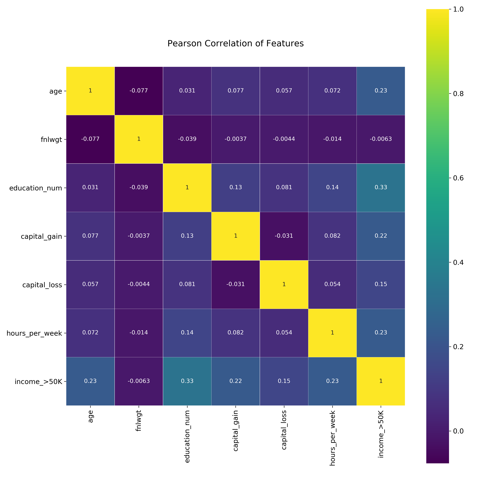

# Predicting Income Class based on US Census Data

I am going to examine the Census Income dataset available at the [UC Irvine Machine Learning Repository](https://archive.ics.uci.edu/ml/datasets/Census+Income). Using this data, I will build ML models to predict whether an individual’s income will be greater than or less than $50,000 USD per year based on features from the census data.


# Test out the model [here](https://classifyincome.appspot.com/):

https://classifyincome.appspot.com/


### About the Data:

The US Adult Census dataset is a repository of 48,842 entries extracted from the 1994 US Census database.

Each entry contains the following information about the class of individual:

- age: the age of an individual

- workclass: a general term to represent the employment status of an individual

- fnlwgt: final weight. In other words, this is the number of people the census believes the entry represents.

- education: the highest level of education achieved by an individual.

- education-num: the highest level of education achieved in numerical form.

- marital-status: marital status of an individual. Note: Married-civ-spouse corresponds to a civilian spouse while Married-AF-spouse is a spouse in the Armed Forces.

- occupation: the general type of occupation of an individual

- relationship: represents what this individual is relative to others. For example an individual could be a Husband. Each entry only has one relationship attribute and is somewhat redundant with marital status. 

- race: Descriptions of an individual’s race

- sex: the biological sex of the individual

- capital-gain: capital gains for an individual (money gained outside of salary)

- capital-loss: capital loss for an individual (money lost outside of salary)

- hours-per-week: the hours an individual has reported to work per week

- native-country: country of origin for an individual

- income: whether or not an individual makes more than 50,000 annually.


## Action Plan:
I will explore the data at face value in order to understand the trends and representations of certain demographics in the census and then I will use these insites to form machine learning models to help predict whether an individual would make more or less than 50,000 USD in 1994.


# Summary of Results:
After cleaning, analyzing, and plotting the data, here are some insights I found:
- Only about 1/3 of the population at the time would be considered high income while 2/3 of the population was making less than 50,000 USD per year.
- The greatest percentage of Asians were making over 50K with White class following close behind
- Capital Gain was a good indicator of wealth with a pretty clear separation of people making higher than 50k with higher capital gain which is an indicator of the wealth gap in the US starting to grow.
- Capital Loss was a mixture of both high income and low income individuals and not a clear indicator of wealth
- Education was a pretty good indicator of income with the highest percentage of high income individuals finishing a pHD, Masters, or Bachelor's degree. The majority of the population had either a high school degree and / or some college finished.
- Married people had the highest percentage of high income people with husbands making up the majority of the workforce
- The male working market more than doubled the female working market in 1994
- The male dominant job was Craft-repair whereas the female dominant job was Adm-clerical
- Our correlation matrices show lots of correlation as well as co-correlation between fields. We had to remove certain fields to prevent co-correlation.




Numerical fields that showed correlation include: `age`, `education_num`, `capital_gain`, `capital_loss`, and `hours_per_week`


After one-hot-encoding all our other nominal categorical fields, the final features we chose for our Machine Learning models were:

- age
- education_num
- capital_gain
- capital_loss
- hours_per_week
- occupation
- relationship
- race


Running Decision Tree and Random Forest allowed us to white-box the most important features that predicted income. The most important features included:

```
('relationship_Husband', 0.24022227776617505),
 ('capital_gain', 0.1974372740362737),
 ('education_num', 0.16012239751917648),
 ('age', 0.08209723212060077),
 ('hours_per_week', 0.0579356319963014),
 ('relationship_Not-in-family', 0.04865200766546678),
 ('occupation_Exec-managerial', 0.04085603962006724),
 ('relationship_Own-child', 0.03805349249015408),
 ('capital_loss', 0.03552910129107107),
 ('occupation_Prof-specialty', 0.030961502151851557),
 ('relationship_Wife', 0.021919831634146583)
```


 
 
**The Machine Learning Model that gave us the most accuracy was the ADABOOST Model using Decision Tree which gave us an 86.96 percent accuracy.**

The following is the summary of the performance of our other models:
```
'Decision Tree Accuracy and Classification Report:'
'84.54 %'
              precision    recall  f1-score   support

           0       0.86      0.96      0.90      7383
           1       0.79      0.51      0.61      2386


'Logistic Regression Accuracy and Classification Report:'
'84.53 %'
              precision    recall  f1-score   support

           0       0.87      0.93      0.90      7383
           1       0.73      0.58      0.65      2386


'KNN Accuracy and Classification Report:'
'84.5 %'
              precision    recall  f1-score   support

           0       0.86      0.95      0.90      7383
           1       0.76      0.53      0.63      2386


'SVM Accuracy and Classification Report:'
'80.46 %'
              precision    recall  f1-score   support

           0       0.81      0.97      0.88      7383
           1       0.75      0.30      0.43      2386


'Random Forest Accuracy and Classification Report:'
'84.91 %'
              precision    recall  f1-score   support

           0       0.85      0.97      0.91      7383
           1       0.84      0.47      0.61      2386


'Ensemble (Hard Voting) Accuracy and Classification Report:'
'85.98 %'
              precision    recall  f1-score   support

           0       0.87      0.96      0.91      7383
           1       0.80      0.56      0.66      2386


'Ensemble (Soft Voting) Accuracy and Classification Report:'
'85.96 %'
              precision    recall  f1-score   support

           0       0.87      0.96      0.91      7383
           1       0.82      0.55      0.66      2386

'Bagging Ensemble Decision Tree Accuracy:'
'84.73 %'
              precision    recall  f1-score   support

           0       0.86      0.95      0.90      7383
           1       0.78      0.52      0.63      2386


'Bagging Ensemble Random Forest Accuracy:'
'83.72 %'
              precision    recall  f1-score   support

           0       0.84      0.97      0.90      7383
           1       0.81      0.43      0.57      2386

'Bagging Ensemble Logistic Regression Accuracy:'
'81.9 %'
              precision    recall  f1-score   support

           0       0.83      0.96      0.89      7383
           1       0.75      0.39      0.51      2386


'Bagging Ensemble KNN Accuracy:'
'81.18 %'
              precision    recall  f1-score   support

           0       0.81      0.99      0.89      7383
           1       0.89      0.26      0.40      2386

'ADABoost Classifier with Decision Tree Accuracy:'
'86.96 %'
              precision    recall  f1-score   support

           0       0.89      0.95      0.92      7383
           1       0.80      0.63      0.70      2386

```


ADABoost CONFUSION MATRIX:

| TRUE POSITIVES | FALSE NEGATIVES|
| -------- | -------- |
| 1383 | 1003 |
| FALSE POSITIVES | TRUE NEGATIVES |
| 508 | 1383 |